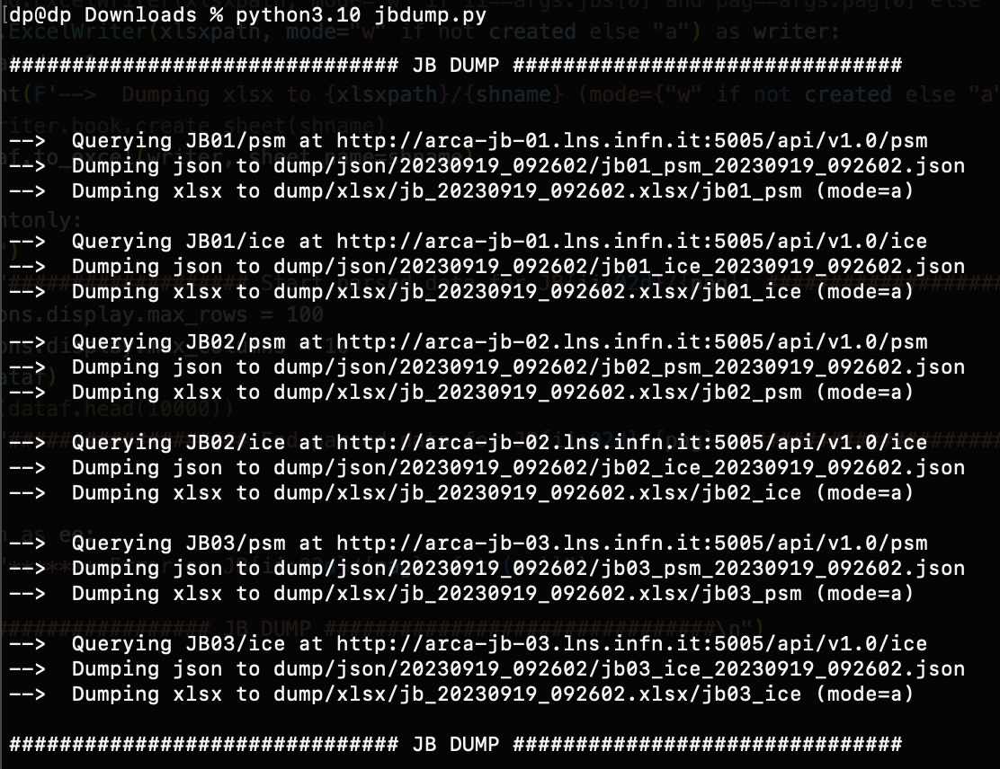

Dump slow control data from JB monitor

Data dupms are:
"./dump/json/%s/jb%02d_%s_%s.json"%(jbnumber, timestamp, page)
"./dump/xlsx/jb_%s.json"%(timestamp)
in the xlsx, one sheet per JB and PAGE is created

